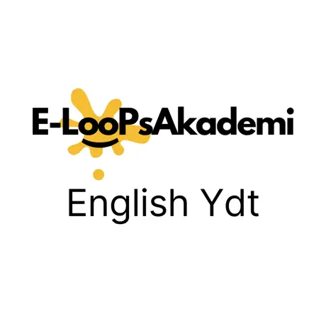
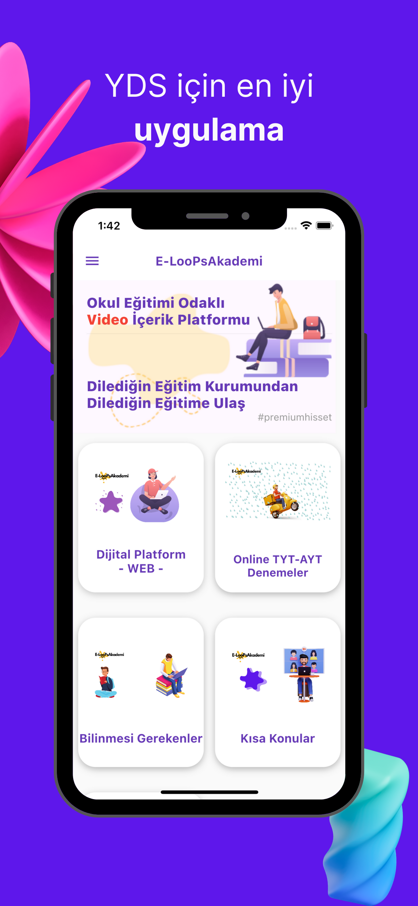
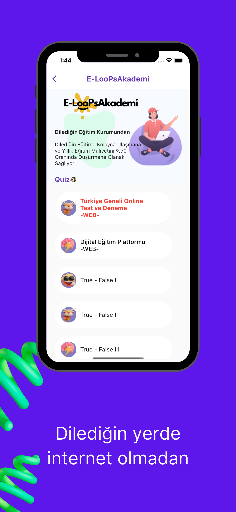
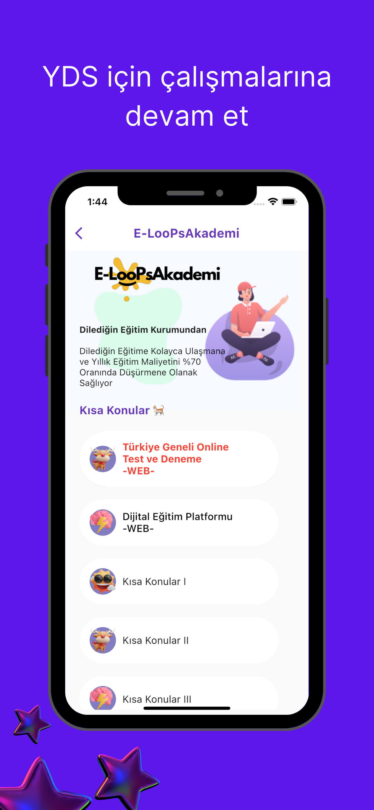
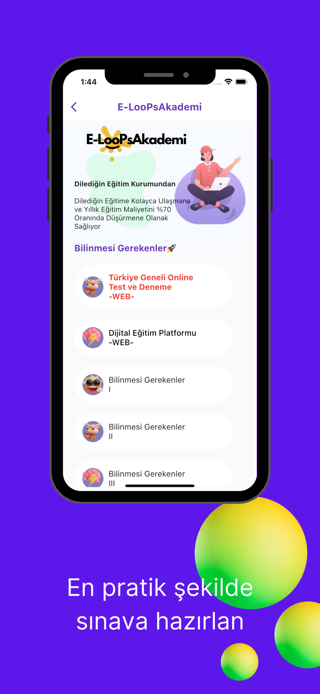
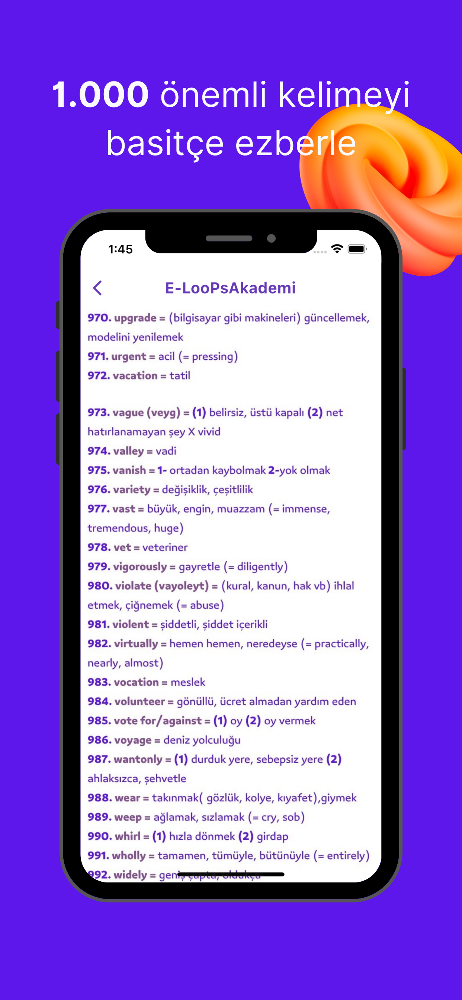
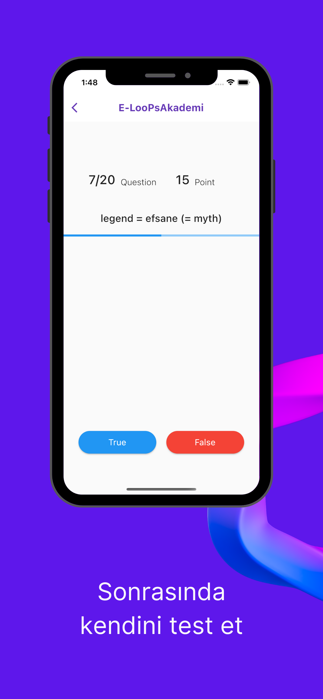

## English YDT
# E-LooPsAkademi

## Uygulama İndirme Linkleri

Uygulamayı indirmek için aşağıdaki linklere tıklayabilirsiniz:

- [Google Play](https://play.google.com/store/apps/details?id=com.Global.TRGame.EnglishYdtELooPsAkademi)
- [AppStore](https://apps.apple.com/tr/app/english-ydt/id1592915208)
- [E-LooPsAkademi WEB](https://www.eloopsakademi.com/)

"İngilizce Öğrenme Uygulaması," kelime dağarcığınızı geliştirmek, kısa konu anlatımları ile anlamınızı artırmak, quizler ile pratik yapmak ve bildirimler ile bilgi almak isteyenler için interaktif bir mobil uygulamadır.

## Özellikler

- Temel kelimeler için kapsamlı kelime dersleri.
- İngilizce dilbilgisi ve kullanımını anlamınızı artırmak için kısa konu anlatımları.
- İngilizce becerilerinizi pratik yaparak geliştirebileceğiniz ilgi çekici quizler.
- Önemli etkinlikler ve güncellemeler hakkında bildirimler ile güncel kalın.

  

    
    
  

  

    
    
  

  

    
    
  

